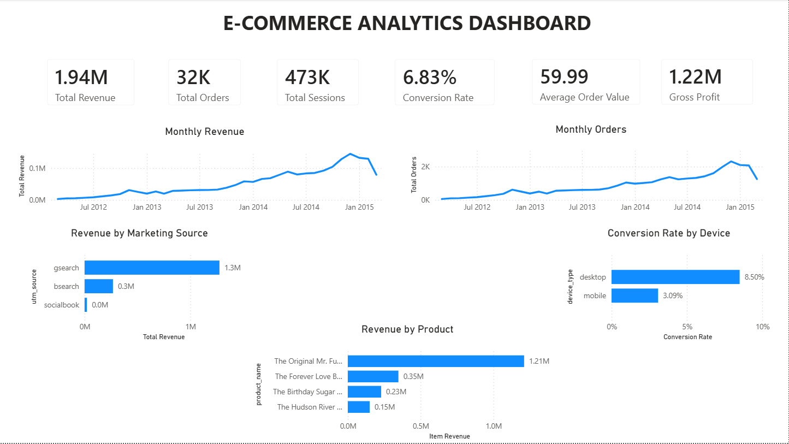
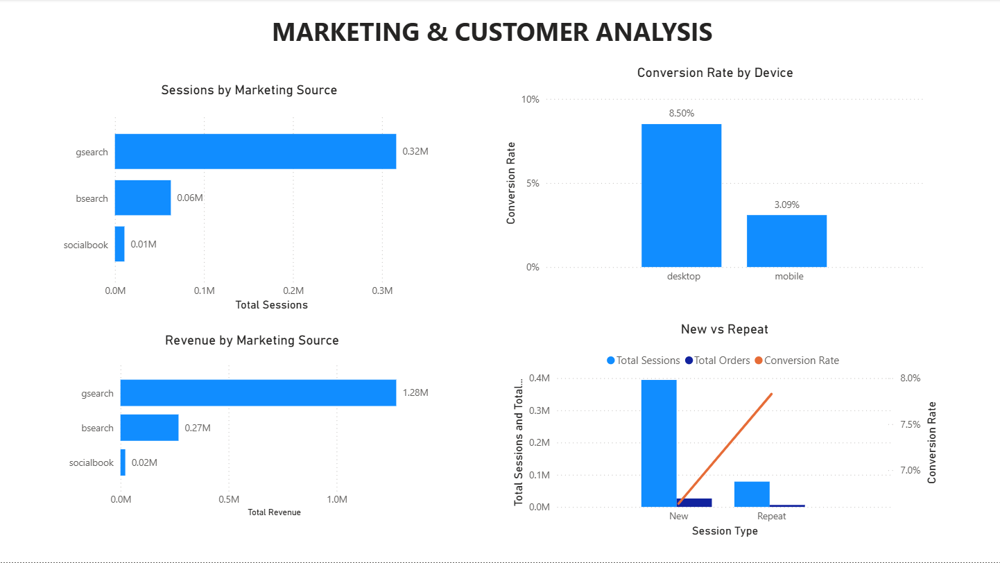
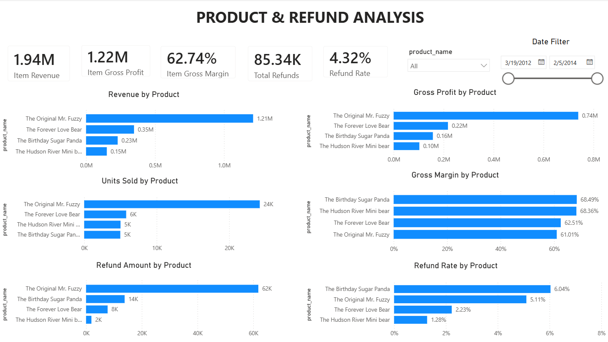

# E-Commerce Analytics — Maven Fuzzy Factory

An end-to-end E-Commerce Analytics portfolio project using **MySQL, SQL, Python, and Power BI** to analyze sales performance, marketing channels, customer behavior, product profitability, and refunds.

---

## Project Objective

Analyze the performance of an e-commerce business and turn raw website, order, product, and refund data into actionable business insights.

The project focuses on:

- Sales and revenue performance
- Website traffic and conversion
- Marketing channel performance
- Customer behavior
- Device performance
- Product profitability
- Refund activity
- Business KPI monitoring

---

## Dashboard

The project includes three Power BI dashboard pages.

### 1. Executive Overview

Provides a high-level view of the business, including revenue, orders, sessions, conversion rate, AOV, gross profit, monthly trends, marketing sources, devices, and products.



### 2. Marketing & Customer Analysis

Analyzes marketing sources, device performance, customer type, sessions, orders, and conversion rates.



### 3. Product & Refund Analysis

Analyzes product revenue, units sold, gross profit, gross margin, refund amounts, and refund rates.



---

## Key Business KPIs

| KPI | Result |
|---|---:|
| Total Sessions | 472,871 |
| Total Pageviews | 1,188,124 |
| Total Users | 394,318 |
| Total Orders | 32,313 |
| Total Revenue | $1,938,509.75 |
| Total COGS | $722,370.25 |
| Gross Profit | $1,216,139.50 |
| Gross Margin | 62.72% |
| Average Order Value | $59.99 |
| Conversion Rate | 6.83% |
| Total Refunds | $85.34K |
| Refund Rate | 4.32% |

---

## Selected Findings

- The business generated approximately **$1.94M in revenue** and **$1.22M in gross profit**.
- Overall website conversion was approximately **6.83%**.
- Average Order Value was approximately **$59.99**.
- Conversion performance improved substantially over time, reaching more than **8% during several months in early 2015**.
- Marketing sources and campaigns show different levels of traffic, revenue, and conversion performance.
- Device performance varies across sessions and conversion rates.
- Product performance differs across revenue, units sold, gross profit, and gross margin.
- Refund activity represents approximately **4.32% of item revenue**.
- Product-level refund rates highlight products that may require additional investigation.

---

## Tools

- **MySQL**
- **SQL**
- **Python**
- **Pandas**
- **NumPy**
- **Matplotlib**
- **Power BI**
- **Git / GitHub**

---

## Dataset

The project uses the **Maven Fuzzy Factory** e-commerce dataset.

### Main Tables

- `website_sessions`
- `website_pageviews`
- `orders`
- `order_items`
- `order_item_refunds`
- `products`

The project also includes the dataset data dictionary.

> The raw dataset does not need to be stored in the public GitHub repository. The repository can contain the project structure, analysis code, outputs, dashboard screenshots, and documentation.

---

## Data Model

The main relationships used in the analysis are:

```text
website_sessions
       |
       | website_session_id
       |
       +-------------------- website_pageviews
       |
       +-------------------- orders
                              |
                              | order_id
                              |
                              +-------------------- order_items
                                                       |
                                                       +---- products
                                                       |
                                                       +---- order_item_refunds
```

Additional analytical fields include `user_id`, `primary_product_id`, marketing attributes, device type, and product information.

The data model supports analysis across website traffic, orders, products, customers, and refunds.

---

## SQL Analysis

The SQL analysis covers:

- Data validation and row counts
- Overall business KPIs
- Revenue, COGS, profit, and margin
- Average Order Value
- Overall conversion rate
- Monthly performance
- Marketing source and campaign performance
- Device performance
- New vs. repeat sessions
- Product performance
- Product profitability
- Refund analysis
- Page performance
- Landing page analysis
- Converted vs. non-converted sessions
- Data quality checks

Main SQL file:

```text
02_SQL/ecommerce_analysis.sql
```

---

## Python Analysis

The Python analysis was used for exploratory analysis, KPI calculations, performance analysis, and visualization.

The script includes:

1. Loading CSV files
2. Data type conversion
3. Missing-value checks
4. Business KPI calculations
5. Monthly performance analysis
6. Marketing performance analysis
7. Device analysis
8. New vs. repeat session analysis
9. Product performance analysis
10. Refund analysis
11. Page performance analysis
12. Data quality checks
13. Chart generation
14. Exporting analytical outputs

Main Python file:

```text
03_Python/ecommerce_analysis.py
```

---

## Python Outputs

The Python analysis generates CSV outputs including:

- `kpis.csv`
- `monthly_performance.csv`
- `marketing_performance.csv`
- `device_performance.csv`
- `new_vs_repeat.csv`
- `product_performance.csv`
- `refund_kpis.csv`
- `refunds_by_product.csv`
- `page_performance.csv`
- `missing_values.csv`
- `data_quality_checks.csv`

Generated charts include:

- Monthly revenue
- Monthly conversion rate
- Revenue by marketing source
- Conversion rate by device
- Revenue by product

Output location:

```text
03_Python/outputs/
```

---

## How to Run

### MySQL

1. Create the database and tables using the database setup SQL file.
2. Load the CSV files into the corresponding tables.
3. Run:

```text
02_SQL/ecommerce_analysis.sql
```

4. Review the KPI and analytical query results.

> If using `LOAD DATA LOCAL INFILE`, make sure MySQL Local Infile is enabled and update the CSV folder path to match your local machine.

### Python

Install the required libraries:

```bash
pip install pandas numpy matplotlib
```

Then run:

```bash
python ecommerce_analysis.py
```

The script reads the CSV files from:

```text
01_Data/
```

and saves analytical outputs to:

```text
03_Python/outputs/
```

### Power BI

Open the Power BI project and connect the dashboard to the prepared data.

The dashboard contains three pages:

1. Executive Overview
2. Marketing & Customer Analysis
3. Product & Refund Analysis

---

## Portfolio Structure

```text
E-Commerce-Analytics/
│
├── 01_Data/
│   ├── README.md
│   └── data dictionary / dataset files
│
├── 02_SQL/
│   ├── 01_create_database_and_load_data.sql
│   └── ecommerce_analysis.sql
│
├── 03_Python/
│   ├── ecommerce_analysis.py
│   └── outputs/
│       ├── kpis.csv
│       ├── monthly_performance.csv
│       ├── marketing_performance.csv
│       ├── device_performance.csv
│       ├── new_vs_repeat.csv
│       ├── product_performance.csv
│       ├── refund_kpis.csv
│       ├── refunds_by_product.csv
│       ├── page_performance.csv
│       ├── missing_values.csv
│       ├── data_quality_checks.csv
│       └── charts/
│
├── 04_PowerBI/
│   ├── ecommerce_dashboard.pbix
│   ├── dashboard_overview.png
│   ├── marketing_customer_analysis.png
│   └── product_refund_analysis.png
│
└── README.md
```

---

## Validation

The project was validated by comparing the SQL and Python calculations with the final Power BI dashboard KPIs.

The dashboard KPIs and analytical outputs were checked against the underlying data to ensure consistency across the different analysis tools.

---

## Project Highlights

This project demonstrates an end-to-end analytics workflow:

```text
Raw Data
   ↓
MySQL Database
   ↓
SQL Analysis
   ↓
Python EDA & Validation
   ↓
Power BI Dashboard
   ↓
Business Insights
```

The goal is not only to calculate metrics, but to transform raw e-commerce data into business-focused insights that can support decisions around **sales, marketing, customers, products, and refunds**.
